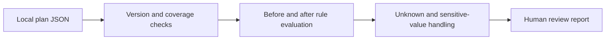

# Terraform Change Review

Explain whether a Terraform plan introduces a security concern, retains an existing one, proposes a fix, or leaves important values unknown.

**Independent portfolio project · Python standard library · offline · synthetic plans**

The review output distinguishes proposed changes from deployed results. This makes the tool useful as an interview demonstration of infrastructure security judgment, evidence handling, and CI design.

## Run the demo

Python 3.10 or newer. No Terraform installation, AWS credentials, package installation, or deployment required:

```sh
python3 review.py examples/plan.json --format markdown
python3 -m unittest -v
```

**The demo intentionally exits `2`** because it includes unknown policy content, a deleted safeguard, and an unsupported resource. This is expected review behavior, not a broken demo. See the committed [review table](examples/report.md), [structured output](examples/report.json), and [tests](test_review.py).

## Supported checks

| Rule | Review question | Supported AWS resource forms |
|---|---|---|
| NET001 | Does an internet-wide CIDR allow TCP SSH/RDP, a range including those ports, or all protocols? | Inline security-group ingress, legacy security-group rule, modern VPC ingress rule |
| S3001 | Is a bucket public-access-block setting explicitly disabled? | `aws_s3_bucket_public_access_block` |
| LOG001 | Is CloudTrail logging explicitly disabled? | `aws_cloudtrail` |
| IAM001 | Does a policy contain an Allow statement with both `Action: "*"` and `Resource: "*"`? | Managed IAM policy and inline role policy |

A matching IAM statement deserves review; its presence does not prove effective administrator access. Conditions, other policies, permission boundaries, SCPs, and explicit denies are outside the evaluator. A disabled bucket safeguard does not by itself prove public access. A public ingress rule does not prove end-to-end reachability.

## How the comparison works



The parser consumes resource changes from [Terraform's documented JSON format](https://developer.hashicorp.com/terraform/internals/json-format). It rejects unsupported major versions, accepts compatible minor versions, handles replacements, and checks relevant unknown/sensitive masks. It reports removed resources for review; deleting a security control is not called a security fix.

Results include `introduced`, `existing`, `resolved_by_plan`, and explicit review states. `resolved_by_plan` means the proposed values no longer match this particular rule. It never means the plan was applied or the control verified live.

| Exit | Meaning within this tool's limited scope |
|---|---|
| 0 | No matching concerns or unresolved checks among supported resources |
| 1 | Introduced or existing matching concern; inspect the report |
| 2 | Input error, unsupported coverage, incomplete plan, unknown values, or a removal requiring review |

Exit `2` takes precedence over `1`; matching concerns remain in the report. Unsupported resources are always listed. An empty plan may return `0`, which is not a whole-environment assessment.

## Boundaries and safe use

Use only plans you are authorized to inspect. Terraform plan JSON can include secrets. The tool does not print raw policy contents or resource values, and it withholds rule evaluation when relevant values are marked sensitive. Reports still contain resource addresses, which can identify systems. Do not publish real plans or reports without review.

This is a deliberately narrow prototype, not a replacement for Checkov, IAM Access Analyzer, Terraform validation, or a security review. It does not evaluate HCL, fetch provider schemas, scan every resource, model routing or effective IAM permissions, apply a plan, or connect to a cloud account. The fixtures are synthetic; broader provider-version compatibility and large-file streaming remain future work.

Developed with AI assistance and verified locally. The included GitHub workflow has not run remotely until the repository is published and a result is observed.

## Contributing

Add a synthetic failing example and regression test for each rule change. Run `python3 -m unittest -v`. Keep unknown inputs explicit, preserve the exit-code contract, avoid raw-value disclosure, and document new resource coverage.
